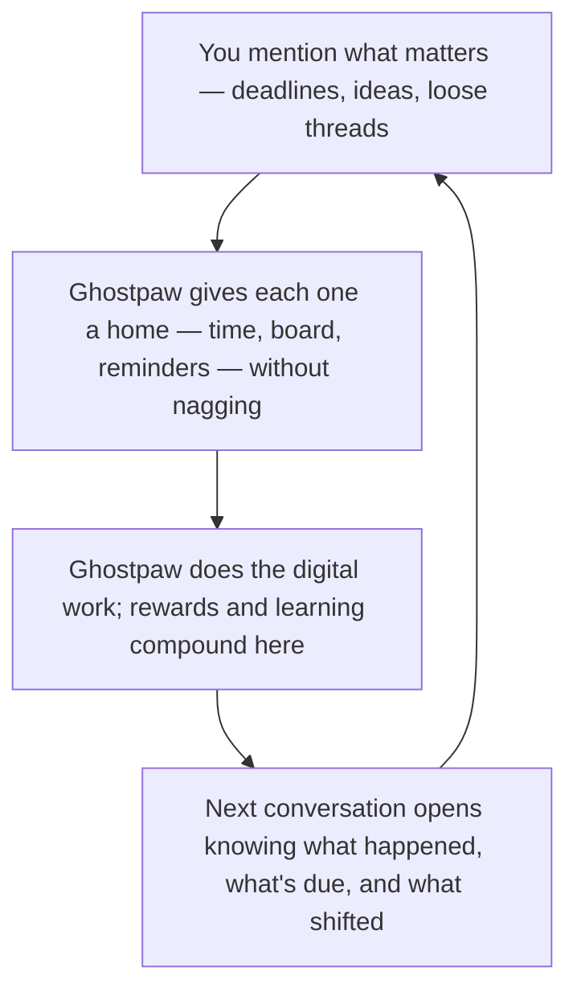

# Quests

Every AI agent that runs for more than an afternoon needs to track what's happening — what's due, what's overdue, what's coming, what was done, and what was missed. Most agents don't. They treat tasks as external: the human maintains a list somewhere, the agent reads it when asked, and temporal awareness is zero. Microsoft's CORPGEN framework [identified four failure modes](https://www.microsoft.com/en-us/research/publication/corpgen-simulating-corporate-environments-with-autonomous-digital-employees-in-multi-horizon-task-environments/) when AI agents manage concurrent tasks without structured storage: context saturation, memory interference, dependency complexity, and reprioritization overhead. Professionals using separate calendar and task tools lose [~6 hours weekly to context switching](https://akiflow.com/blog/calendar-task-management-integration-productivity), with 23-minute average refocus time per interruption. For an LLM agent, every tool call to check a separate system burns tokens and attention.

Ghostpaw's quests solve this with a single insight: a task, an event, a deadline, a reminder, and a recurring commitment are all the same entity — a quest — distinguished only by which optional fields are populated. One table. One schema. One set of tools. The LLM never needs to decide "is this a task or a calendar event?" — it creates a quest and fills in whatever applies. This eliminates the integration problem entirely because there is nothing to integrate. [42% of professionals misuse calendars as task managers](https://paperlessmovement.com/articles/the-calendar-trap-why-your-task-management-system-needs-a-complete-overhaul), forcing every task into a time slot that creates rescheduling overhead. The unified model avoids this by making temporal fields optional, not structural.

Managed by the **Warden** soul. The warden owns all persistence — memory, pack bonds, and quests — because it sees across systems where others see within them. A question about "what's due this week" spans quests (commitments), memory (beliefs about the user's work patterns), and pack (who's involved). The warden is the only soul that queries all three and detects when they disagree.

## The quest flywheel

You talk about what's ahead — a deploy on Friday, a dentist appointment, a half-formed idea you're not ready to commit to. Ghostpaw picks it up and gives it a home: a quest with whatever time detail fits, tracked without turning into another inbox that nags. The loop **closes** when you let ghostpaw do the work — that's where XP, skill fragments, and real learning happen. Handle it yourself and the storyline still moves, but ghostpaw doesn't grow from watching you check a box. One read of the cycle is enough; the rest of this document unpacks schema, states, and tools.



*Implementation anchor — not the emotional read above:* **Ghostpaw** proposes and embarks. **The Warden** persists quests, temporal context, board state, and validates autonomous runs. **Prowl** picks eligible work on heartbeat; **done → turned_in** is the reward ceremony (XP, sealed shards, skill fragments). Human-completed quests advance the storyline but produce no session — the asymmetry is structural.

## What You Get

**Your commitments have a home.** "Deploy v2.3 by Friday" is a quest with a `due_at` timestamp. "Weekly standup" is a quest with an RRULE recurrence rule. "Call the dentist" is a quest with no temporal metadata — just a thing that needs doing, tracked until done. "Had a difficult client meeting on March 1st" is a quest created retroactively in `done` state — a timestamped event in the permanent record. All of these are the same entity. No separate calendar app, no separate todo list, no integration layer. One system that speaks the language of time.

**Ghostpaw knows what's happening.** Temporal context is always one tool call away: the warden queries what's overdue, what's due soon, what's happening today, what's active, and what reminders are pending. During haunting, this context is assembled automatically — ghostpaw sees the full temporal landscape as part of its autonomous exploration. In the CLI, the default `ghostpaw quests` command shows the same summary. The coordinator delegates to the warden whenever temporal awareness matters, and the warden's `quest_list` tool with `temporal: true` returns the complete picture. Ghostpaw, aware that a deadline is approaching, thinks differently about what's worth discussing. [Temporal knowledge graphs achieve 94.8% accuracy on deep memory retrieval and 18.5% improvement on temporal reasoning](https://arxiv.org/html/2501.13956v1) by anchoring facts in time. Quests are simpler than a full knowledge graph but serve the same purpose.

**The Quest Board.** An unsorted opportunity space — not an inbox, not a GTD bucket. Ghostpaw proposes quests it noticed during conversations, haunts, and consolidation: "You mentioned a deploy deadline Friday — I'm tracking it." The human dumps quick ideas: "Maybe I should refactor that auth module." Both land on the board as `offered` quests. Accept when you're ready. Dismiss when you're not. No notification pressure, no unread badges, no processing anxiety. [80.8% of workers feel anxiety about unprocessed inboxes](https://www.readless.app/blog/inbox-zero-statistics-2026). The Quest Board is designed to feel like a town bulletin board in an RPG — things exist there, they can sit indefinitely, and you browse when you want to. The [Ovsiankina Effect](https://www.nature.com/articles/s41599-025-05000-w) — a robust 67% tendency to resume interrupted tasks — makes accepted quests naturally pull toward completion without artificial pressure.

**Storylines group related work — in order.** A storyline named "Website Redesign" contains quests as ordered objectives. Each quest has a position within its storyline, auto-assigned on creation and reorderable on demand. Ghostpaw enforces the sequence: a quest can't be embarked until all preceding quests in its storyline are terminal. Storyline deadlines propagate downward — a quest without its own `due_at` inherits its storyline's deadline for temporal context, embark priority, and overdue detection. Progress is computed live — total, done, active, accepted, blocked — and rendered as concrete counts, not misleading percentages. [Basecamp's insight](https://basecamp.com/hill-charts): task counts are misleading because tasks aren't equal. The meaningful signal is which quests are blocked, which are active, and whether the unknowns have been resolved.

**Recurring quests track habits — with streaks.** `FREQ=DAILY` is a daily. `FREQ=WEEKLY;BYDAY=MO,WE,FR` is Monday/Wednesday/Friday. [RFC 5545 RRULE](https://tools.ietf.org/html/rfc5545) stores the intended pattern — "every third Thursday March–June," "second Sunday in May," bounded or infinite. [Every practitioner says the same thing](https://www.codegenes.net/blog/calendar-recurring-repeating-events-best-storage-method/): don't reinvent recurrence rules. Individual occurrences are tracked as they happen — completing or skipping one records it without affecting the base quest. Every recurring quest shows a live streak: current consecutive completions, longest streak ever, total done/skipped. Streaks are strict — miss one occurrence or skip one, and the streak resets to zero. [Loss aversion makes streak progress ~2x more painful to lose than equivalent gains](https://www.smashingmagazine.com/2026/02/designing-streak-system-ux-psychology/), creating a natural "second-level objective" that reduces mental negotiation about whether to perform the task. During haunting, ghostpaw surfaces at-risk streaks before they break. The web UI provides a recurrence picker mapping common patterns to RRULE strings.

**Full-text search across everything.** Quests are searchable by title and description via FTS5. "What was that deploy issue?" returns the quest instantly. No embedding, no vector search — just fast, precise full-text matching on structured temporal data.

**Everything compounds into ghostpaw's evolution.** Quests have a two-phase completion lifecycle: `done` marks the work as complete, `turned_in` reveals the rewards. For autonomous quests, post-completion consolidation drops sealed soul shards — behavioral observations that remain hidden until turn-in — and writes a turn-in narrative: a 2-4 sentence warden-authored summary of what was accomplished, how, and what was learned. The narrative is pre-computed during consolidation so the turn-in ceremony is instant — no LLM call at reveal time. Turning in a quest reveals those shards, drops a skill fragment using the narrative (or a fallback for human-completed quests), and displays XP earned. The ceremony feeds both the [soul evolution pipeline](LLM.md) (via revealed shards) and the AI-facing skill layer described in [LLM.md](LLM.md) in a single celebratory moment. Quest state changes feed the [trail](TRAIL.md) nightly sweep, giving the historian material for chronicles and chapter detection. The quest system is not just tracking what needs doing — it is the primary source of temporal facts that make every other subsystem time-aware.

**The delegation gradient makes autonomy rewarding.** Ghostpaw-executed quests produce rich sessions — focused tool usage, multi-step reasoning, error recovery — that yield full XP and feed the soul evolution pipeline. Human-executed quests advance the storyline but produce minimal learning for ghostpaw: no sessions, no tokens, no XP, no drops. The incentive is structural: delegating to ghostpaw means it gets smarter at that kind of work, making future similar quests faster and cheaper. [People forgo monetary rewards to retain control](https://papers.ssrn.com/sol3/papers.cfm?abstract_id=2733142) — the delegation nudge must make autonomy feel safe, not like losing control. [Trust is the strongest predictor of delegation willingness](https://delegability.github.io/about.html), and [AI delegation actually increases human self-efficacy](https://dl.acm.org/doi/full/10.1145/3696423) when framed as empowerment rather than abdication. Ghostpaw offers to embark, shows estimated rewards, and respects "I'll handle it" without pushback. [Delegation willingness varies dramatically by task type](https://link.springer.com/article/10.1007/s00146-026-02858-5) — routine tasks delegate readily, high-stakes judgment calls don't. The ghost adapts: more assertive about embarking on routine work, more deferential about complex decisions. The differential is visible before execution: "If you do it: storyline advances. If I embark: ~120 XP + potential drops + I learn the pattern." Not pushy. Observational. The data is already there.

**Ghostpaw embarks on quests autonomously.** Quests created by ghostpaw with `created_by: ghostpaw` are eligible for autonomous execution. The `prowl` heartbeat scans for eligible quests every 60 seconds, spawns an embark session, and ghostpaw works through the quest with step-by-step warden validation. The warden plans **subgoals** — dynamic execution checkpoints — before work begins, marks them done as progress is confirmed, and calls `quest_done` when all objectives are met. If ghostpaw gets stuck after three consecutive warden rejections, the quest is set to `blocked` for human review. If the daily spend limit is hit, the session closes gracefully and prowl resumes when budget allows. Subgoals persist across sessions — a multi-hour quest interrupted by budget or turn limits picks up exactly where it left off. The `tend` heartbeat runs every 30 minutes, dismissing stale board entries older than 14 days and logging quests stuck without updates for 48+ hours.

## How It Works

### The Unified Model

The core design: tasks and events are not different types. They are the same entity with different metadata populated.

| What it looks like | What it actually is |
|---|---|
| A todo item | A quest with no temporal metadata |
| A deadline | A quest with a `due_at` timestamp |
| A calendar event | A quest with `starts_at` and `ends_at` |
| A recurring commitment | A quest with a recurrence rule |
| A reminder | A quest with a `remind_at` timestamp |
| A completed action | A quest in `done` state with a completion timestamp |
| A logged event | A quest created retroactively in `done` state |

All timestamps are Unix milliseconds (`Date.now()`) — the same convention used by every other ghostpaw table. No ISO strings in storage. Human-readable formatting is a channel concern.

### The State Machine

Eight states, clear transitions:

```
     ┌──────────┐
     │ offered  │──── accept ──┐
     └────┬─────┘              │
          │ dismiss             │
          ▼                    ▼
     ┌──────────┐        ┌──────────┐
     │abandoned │   ┌───>│ accepted │
     └──────────┘   │    └────┬─────┘
                    │         │
                    │    ┌────▼────┐
                    │    │  active  │────────┐
                    │    └────┬────┘        │
                    │         │             │
                    │    ┌────▼─────┐  ┌────▼─────┐
                    │    │  blocked  │  │   done    │─── turn in ──┐
                    │    └──────────┘  └──────────┘               │
                    │                                        ┌────▼─────┐
                    │    ┌──────────┐                        │turned_in │
                    └────│  failed   │                        └──────────┘
                         └──────────┘
```

| State | Meaning |
|---|---|
| `offered` | On the Quest Board — proposed by ghostpaw or quick-dumped by human, not yet accepted |
| `accepted` | Taken from the board or created directly, not yet started |
| `active` | In progress |
| `blocked` | Waiting on something external |
| `done` | Completed successfully — work is finished, rewards awaiting turn-in |
| `turned_in` | Rewards revealed — sealed soul shards unsealed, skill fragment dropped, XP displayed |
| `failed` | Attempted and failed |
| `abandoned` | Intentionally walked away from |

Terminal states: `done`, `turned_in`, `failed`, `abandoned`. The `done → turned_in` transition is the reward ceremony — it reveals sealed soul shards, drops a skill fragment, and displays cumulative XP. Offered quests are excluded from temporal context and progress tracking. Non-terminal states can transition to any other state. Every transition updates `completed_at` for terminal states or relevant temporal fields. Retroactively logged events enter directly as `done`. Quests can be created directly as `accepted`, bypassing the board.

### The Quest Board

Two origins, two roles:

- **Ghostpaw-created** (`created_by: ghostpaw`) — ghostpaw noticed something worth tracking during conversation, haunting, or consolidation. "I found something worth doing."
- **Human-created** (`created_by: human`) — the human quick-dumped an idea before committing to it. "Maybe I should do this."

Both are `status: offered`, distinguished by `created_by`. Accept transitions to `accepted` (optionally assigning to a storyline). Dismiss transitions to `abandoned`. The board is deliberately unstructured — no sorting, no priority enforcement, no deadlines nagging. A holding pen where things sit until the human or ghostpaw decides they matter enough.

[Implementation intentions neutralize intrusive thoughts from open goals](https://users.wfu.edu/masicaej/MasicampoBaumeister2011JPSP.pdf) — you don't need to complete a task to reduce its cognitive burden, simply making a concrete plan is sufficient. Quest capture IS that concrete plan: ghostpaw externalizes the commitment into a quest with a title, temporal metadata, and context. The brain can let go because the plan exists. But [cognitive offloading creates dependency](https://www.nature.com/articles/s44159-025-00432-2) — if ghostpaw drops a quest, the user's internal encoding is already degraded. This means the quest system must be trustworthy and persistent. Ghostpaw's proactive temporal awareness — overdue detection, reminders, stale quest surfacing — is the trust mechanism that makes cognitive offloading safe.

### Storylines

A storyline groups related quests into a named project, direction, or theme — what Basecamp calls a "scope," what RPGs call a "quest chain."

Storylines are flat — no nesting. A quest belongs to at most one storyline. Each quest within a storyline has a `position` value that determines execution order — auto-assigned on creation (gap-spaced by 1000 for easy reordering) and reorderable in bulk. When listing quests by storyline, they sort by position. When ghostpaw selects quests for autonomous execution, it enforces the sequence: a storyline quest is only eligible if all quests with lower positions are in terminal states. This makes storylines true quest chains — not just groupings, but ordered pipelines.

Storylines without quests are allowed (placeholder for future work). Three statuses: `active`, `completed`, `archived`. The difference: completed means the work was done. Archived means the direction was shelved. Both are terminal but carry different meaning. Archived storylines can be reactivated. A storyline's `due_at` propagates to all quests that lack their own deadline — one deadline covers the chain.

Progress is computed, not stored: `total`, `done`, `active`, `accepted`, `blocked`, `offered`. Raw counts tell the truth. The LLM or UI interprets them. No percentage stored, no hill chart position — the data speaks for itself.

### Recurrence

Recurring quests store an [RRULE](https://tools.ietf.org/html/rfc5545) string on the base quest. The RRULE describes the intended pattern — human-readable and parseable by standard libraries. Individual occurrences are tracked in `quest_occurrences` as they happen: completing or skipping an occurrence records it without affecting the base quest or other occurrences. The base quest stays in its current status regardless of individual occurrence results. The web UI's recurrence picker maps common patterns (daily, weekly, monthly, yearly) to valid RRULE strings and back.

```
FREQ=DAILY                           — every day
FREQ=WEEKLY;BYDAY=MO,WE,FR          — Monday, Wednesday, Friday
FREQ=MONTHLY;BYDAY=2TU              — second Tuesday of every month
FREQ=YEARLY;BYMONTH=3;BYMONTHDAY=6  — March 6th every year
FREQ=WEEKLY;COUNT=10                 — weekly, 10 times total
FREQ=DAILY;UNTIL=20260401T000000Z   — daily until April 1st
```

No custom recurrence format. RRULE handles every pattern, is [well-documented](https://wimonder.dev/posts/adding-recurrence-to-your-application), and parseable by standard libraries.

### Temporal Context

The quest system's primary contribution to the agent runtime is temporal awareness — the ability to reason about what's happening in time. `getTemporalContext()` assembles a compact snapshot from pure SQL. Deadlines propagate from storylines: a quest without its own `due_at` inherits its storyline's deadline, so temporal urgency flows through the entire project structure without manual per-quest deadlines.

- **Overdue** — quests past their effective deadline (own or inherited) and status not terminal
- **Due soon** — quests with effective deadline within the coming week
- **Today's events** — quests with `starts_at` today
- **Active quests** — quests in `active` or `blocked` state
- **Pending reminders** — quests with `remind_at` in the past and not yet surfaced

This summary is consumed in three places. The **warden's `quest_list` tool** returns it when called with `temporal: true` — available during any conversation via coordinator delegation. The **haunt cycle** calls it automatically during context assembly, giving ghostpaw a full temporal landscape for autonomous exploration (including stale quests, recent completions, and the upcoming week). The **CLI** shows it as the default `ghostpaw quests` output. All reads are pure SQL, zero LLM tokens. [Autonomous wake-up scheduling](https://zylos.ai/research/2026-02-16-autonomous-task-scheduling-ai-agents) — agents that self-schedule based on temporal conditions — is identified as a foundational capability for proactive behavior. Quests with due dates and reminders provide the temporal triggers that make this possible.

[State-of-the-art models achieve only 34.5% accuracy on temporal reasoning without tools, but tool-augmented approaches reach 95.31%](https://arxiv.org/abs/2511.09993). The warden's `datetime` tool exists precisely for this reason — LLMs need computation tools for temporal math.

### What Quests Do Not Store

**Beliefs.** "The user prefers TypeScript" is a [memory](MEMORY.md), not a quest. Quests are actions and events, not knowledge.

**Relationships.** "The user was frustrated during the deploy" is a [pack](PACK.md) interaction. The quest records "Deployed v2.3" as a completed event. The emotional context lives in the bond.

**Procedures.** "How to deploy" is part of the AI-facing skill layer described in [LLM.md](LLM.md). "Deploy v2.3 by Friday" is a quest. The quest tracks the commitment; the skill tracks the knowledge.

**Conversation history.** "We discussed the migration" is a session. Quests may reference sessions but don't replace them.

## The Warden

The warden is the quest system's managing [soul](LLM.md) — the same soul that manages [memory](MEMORY.md) and [pack](PACK.md). This is deliberate: the warden sees across persistence systems where other souls see within them. A question about a person spans memory (beliefs), pack (relationships), and quests (commitments). The warden is the only soul that queries all three, which makes it the only soul that can detect when they disagree.

### Tool Surface

Ten tools cover every quest operation, safely within the [tool-count cliff](https://vercel.com/blog/we-removed-80-percent-of-our-agents-tools) where selection accuracy degrades:

| Tool | What it does |
|---|---|
| `quest_create` | Create a quest. Title required, everything else optional. Optional `status: "offered"` for the board. |
| `quest_update` | Update any quest field. All temporal fields as Unix milliseconds — no date parsing ambiguity. |
| `quest_done` | Mark a quest as completed (or record a recurring occurrence). Returns cumulative XP earned. Prompts turn-in for non-recurring completion. |
| `quest_turnin` | Turn in a completed quest to reveal rewards. Reveals sealed soul shards, drops a skill fragment, and transitions `done → turned_in`. |
| `quest_list` | Query by filter or search by keyword. Supports `temporal: true` for the full temporal context view. |
| `quest_accept` | Accept an offered quest from the board. Transitions `offered → accepted`. |
| `quest_dismiss` | Dismiss an offered quest. Transitions `offered → abandoned`. |
| `quest_subgoals` | Manage subgoals within a quest: list, add, mark done, remove, reorder. Used by the warden during autonomous execution. |
| `storyline_create` | Create a storyline (project/quest chain grouping). |
| `storyline_list` | List storylines with computed progress counts. |

Minimal surface area. Ghostpaw doesn't need 15 quest tools. It needs to create, update, complete, turn in, accept, dismiss, and query. Everything else is a query parameter.

## A Gamer's Guide to Quests

The naming is not cosmetic. RPG quest systems solve the exact same design problem: tracking what needs doing across multiple independent storylines with dependencies, deadlines, and varying priority.

**Storylines** are literally an RPG quest chain. A storyline named "Website Redesign" groups quests as objectives. Opening a storyline shows what's done, what's active, what's accepted. The metaphor is instant — no onboarding needed.

**Main quests vs. side quests** emerge naturally. Storylines with deadlines and high-priority quests are main quests — the critical path. Storylines without deadlines or low-priority items are side quests. The system doesn't enforce this through types. It emerges from which fields are populated.

**Recurring quests are dailies and weeklies — with visible streaks.** Every MMO player understands tasks that reset on a schedule. `FREQ=DAILY` is a daily quest. `FREQ=WEEKLY;BYDAY=MO` is a Monday weekly. Streaks are tracked automatically: "12-day streak on Morning Standup Notes." Miss one and it resets — just like in the games. [Users reaching a 7-day streak are 3.6x more likely to complete their course](https://marketingmonsters.io/blog/the-science-behind-streak-based-motivation). Streak visibility IS the mechanism.

**XP is real.** Every session earns XP — a [Weber-Fechner logarithmic metric](https://en.wikipedia.org/wiki/Weber%E2%80%93Fechner_law) computed at session close from tokens processed, tool diversity, and session duration. Quest XP is the sum of all linked sessions' XP. `computeSessionXP()` is a pure function in `lib/` — no database dependency, fully testable. XP is stored on the session row (`xp_earned REAL`), aggregated per quest via `getXPByQuest()`, and surfaced in CLI `show`, the web detail view, and tool output from `quest_done`. Pre-embark cost estimates project token spend and expected XP from historical ghostpaw-completed quest data via `estimateQuestCost()`. Human-completed quests have 0 XP naturally — no sessions, no tokens, no XP. The delegation incentive falls out of the design without needing a special case. In the soul system, completed quests ARE the evidence that drives trait acquisition. The js-engineer soul that completed 50 code quests has earned traits from those sessions. Quest completion isn't fake gamification — it is the actual input to the evolutionary system described in [SOULS.md](SOULS.md). Completing quests literally makes ghostpaw stronger through evidence-driven refinement. No bolt-on reward system needed.

[Deep gamification with story progression and character growth drives retention for years — task completion rates improve 40–60% over traditional lists](https://www.mainquest.net/gamified-habit-trackers-effectiveness-research-2026). Shallow pointsification (slapping badges on activities) loses effectiveness after 2 weeks. Ghostpaw's quest system is deep by construction: autonomy (quest selection), competence (soul level-ups from quest evidence), relatedness (pack bonds). [Self-Determination Theory identifies these three as the drivers of intrinsic motivation](https://doi.org/10.1037/0003-066X.55.1.68), and the quest system satisfies all three structurally. The [overjustification effect](https://psycnet.apa.org/record/1999-01567-001) warns that external rewards on intrinsically motivated activities can reduce motivation. Defense: XP accrues silently as a natural byproduct of every session, storyline progression is the primary reward, drops are rare surprises. Ghostpaw never frames tasks as "do this for XP." If it ever feels like a points treadmill, the design has failed.

**Quest markers are a visual language.** Borrowed from WoW, quest markers communicate state at a glance. Yellow `!` means a new quest is available — ghostpaw proposes something worth tracking. Blue `!` means a recurring quest instance is due. Grey `?` means a quest is accepted or active, work ongoing. Yellow `?` means a quest is done and ready for turn-in. The markers are computed from quest state, never stored — pure presentation logic derived from `status`, `created_by`, and `rrule`. Gamers recognize them instantly. Non-gamers learn them in one session because the visual logic is consistent. [WoW shipped with 2,600 quests and grew to 7,650, with 16 million completed daily](https://www.gamedeveloper.com/game-platforms/gdc-learning-from-i-world-of-warcraft-i-s-quest-design-mistakes) — visual indicators (`!` and `?` markers) solved the critical problem of making quest availability instantly visible across an entire world.

| Marker | Ghostpaw Meaning |
|---|---|
| `!` yellow | Ghostpaw proposes a new quest (board) |
| `!` blue | Recurring quest instance due |
| `?` grey | Quest accepted or active, in progress |
| `?` yellow | Quest done, ready for turn-in |

**Motivation accelerates near the finish line.** The [goal-gradient hypothesis](https://en.wikipedia.org/wiki/Goal_pursuit#Goal_gradient_effect) — one of psychology's most replicated findings — shows that effort increases as perceived distance to completion decreases. Café loyalty card holders purchase 20% faster in the final stretch. [Endowed progress](https://doi.org/10.1086/500480) amplifies the effect: people given a 12-stamp card with 2 stamps filled outperform those given a blank 10-stamp card. Visible progress counts ("3 of 7 quests done in Website Redesign") create two simultaneous goal-gradient effects: macro (storyline progress) and micro (subgoal completion within a quest). [LinkedIn profiles increase completion from 20% to 55% when a progress bar appears](https://www.nirandfar.com/how-to-design-for-the-goal-gradient-effect/). Subgoals checking off during quest execution IS the progress bar. WoW's [strictly sequential quest chains](https://wow.zamimg.com/uploads/guide/images/28066.jpg) validate the motivational mechanism — each completed quest moves visibly closer to the chain's climax.

**Not every quest drops rewards — by design.** [Variable ratio reinforcement is "remarkably resistant to extinction"](https://netpsychology.org/loot-boxes-and-addiction-why-we-love-and-fear-randomness-in-games/) — unpredictable rewards maintain engagement where fixed schedules habituate. Most quests yield XP only. Skill fragments and soul shards drop when the execution produced genuinely novel patterns — [roughly 10% of tasks generate generalizable learning](https://arxiv.org/abs/2510.08002). [Learning rates are proportional to the duration between rewards, not frequency](http://www.nature.com/articles/s41593-026-02206-2) — spacing rewards is neurobiologically correct. Spamming drops on every quest would habituate; sparse, meaningful drops with consistent XP is the right design. A pity mechanism widens the warden's evaluation lens after consecutive dry turn-ins, [preventing frustration streaks without destroying rarity](https://pulsegeek.com/articles/how-to-set-loot-table-probabilities-responsibly/).

**Failed quests teach the most.** [Error recognition primes the brain for learning](https://link.springer.com/article/10.1007/s10648-025-10013-7) through cortisol, dopamine, and serotonin — neurochemical systems that directly affect neuroplasticity. [Productive failure outperforms instruction-first on conceptual understanding](https://sites.temple.edu/edvice/2026/01/21/the-gift-of-error-reclaiming-failure-in-the-classroom/) because the struggle IS the learning. [Vicarious failure is equally effective when solution attempts show diversity](https://link.springer.com/article/10.1007/s11251-025-09706-x) — ghostpaw learning from its own failures AND from failures the human reports are both valid paths. Failed quest turn-ins should lean into "what was tried, where it broke, what diverse approaches were considered" — that's where the soul evolution signal is strongest. The architecture supports this: failed quests can also be turned in, and the warden's failure evaluation is potentially the richest learning source.

## How Quests Compound

**Day 1** — the quest system is empty. Ghostpaw tracks nothing. It responds to what's in front of it. Temporal context reads return empty — graceful, not broken.

**Week 2** — the human has created a few storylines and some recurring dailies. Ghostpaw sees upcoming deadlines in its temporal context — including deadlines inherited from storylines. During haunting, it notices a stale quest and asks about it. Streaks on recurring quests start building — "5-day streak on Journal Review." It starts creating its own quests during work decomposition — breaking a large task into ordered steps within a storyline. The Quest Board has its first ghostpaw-proposed entries. With `prowl` enabled, ghostpaw-created quests begin executing autonomously in storyline order — subgoals track each step, the warden validates progress, and completed quests appear without human intervention.

**Month 2** — dozens of completed quests provide evidence for soul refinement. Ghostpaw has learned the human's patterns: which deadlines are real, which are aspirational. Recurring quests have built long streaks — the 30-day meditation streak is motivation in itself. The temporal context summary is rich enough that ghostpaw proactively manages time — "you have three things due this week, want me to prioritize?" Quest markers show at a glance: yellow `!` for new proposals, yellow `?` for quests ready to turn in, grey `?` for work in progress. Turning in quests reveals sealed soul shards from autonomous execution, shows the warden's narrative summary of what was accomplished, and drops skill fragments into the training pipeline. The trail's nightly sweep reads quest state changes as input for chronicles.

**Month 6** — the quest history is a structured log of everything that happened and when. Ghostpaw's temporal reasoning is grounded in months of pattern data. It knows that Friday deploys slip to Monday. It knows the user forgets recurring tasks unless reminded Wednesday. This knowledge lives in memory, informed by quest data. The quest system provides the facts. Memory provides the interpretation. Together they give ghostpaw something no other agent has: a genuine sense of time passing and commitments within it.

## How This Compares

Every agent framework treats task management as an external concern or ignores it entirely.

| Capability | Ghostpaw | ChatGPT | Claude | Copilot | Todoist/Cal |
|---|---|---|---|---|---|
| Unified task/event/deadline model | Single schema, optional fields | No | No | No | Separate apps |
| Temporal awareness in agent context | On-demand + automatic in haunts | No | No | No | N/A |
| Quest Board (proactive proposals) | Ghostpaw proposes, human accepts | No | No | No | N/A |
| Recurrence (RRULE) | Full RFC 5545 | No | No | No | Partial |
| Full-text search | FTS5 across titles + descriptions | No | No | No | Basic |
| Bidirectional task flow | Ghostpaw creates + completes quests | Human only | Human only | Human only | Human only |
| Feeds soul evolution | Quest evidence → trait refinement | No | No | No | N/A |
| Feeds skill discovery | Fragment drops on turn-in | No | No | No | N/A |
| Feeds temporal trail | State changes → chronicle input | No | No | No | N/A |
| Survives platform wipes | SQLite, user-controlled | N/A | N/A | N/A | Vendor-controlled |

The gap is structural. Other agents can answer questions about tasks if you tell them what the tasks are. Ghostpaw tracks commitments natively, reasons about them temporally, proposes new ones proactively, and feeds every completion into the evolutionary pipeline that makes ghostpaw better over time. [Separate reliability from personality](https://dev.to/mem0/building-memory-first-ai-reminder-agents-with-mem0-and-claude-agent-sdk-3380) — facts about tasks live in structured storage, learned patterns about how the user works live in memory. Different systems, different semantics, reinforcing each other.

## Inspection

**Web UI.** The `/quests` page provides three tabs: **Quest Log** (filtered list with status pills, priority badges, relative timestamps, search, and a bulletin board teaser), **Quest Board** (offered quests with accept/dismiss actions, quick-add input, and optional storyline assignment on accept), and **Storylines** (storylines as cards with computed progress). Quest detail shows full metadata, streak info and occurrences for recurring quests, and trail context hints (current chapter + linked open loops). Storylines have a detail page with nested quests, progress counts, edit, and completion actions. Toolbar provides status, priority, and storyline filters. Recurrence is configured via a picker that maps common patterns to RRULE strings.

**CLI.** All commands under `ghostpaw quests`:

| Command | What it does |
|---|---|
| `quests` | Temporal summary: overdue, due soon, active, today's events |
| `list` | List quests with status, priority, and storyline filters |
| `search <query>` | Full-text search across titles and descriptions |
| `show <id>` | Quest detail with streak info, occurrences, XP earned, cost estimate, and metadata |
| `add` | Create a quest (title, optional description, status, priority, temporal fields) |
| `done <id>` | Mark complete (optional occurrence timestamp for recurring quests) |
| `turn-in <id>` | Turn in a completed quest — reveals sealed soul shards, drops skill fragment, shows XP |
| `update <id>` | Update quest fields |
| `board` | List offered quests |
| `offer` | Create a quest with status `offered` |
| `accept <id>` | Accept an offered quest |
| `dismiss <id>` | Dismiss an offered quest |
| `embark <id>` | Autonomously execute a quest — spawns coordinator sessions with warden validation. Displays session XP on completion. |
| `prowl` | Scan for eligible quests and spawn embark processes |
| `tend` | Quest board maintenance — dismiss stale entries, log stuck quests |
| `storyline-list` | List storylines with status filter |
| `storyline-add` | Create a storyline |
| `storyline-show <id>` | Storyline detail with nested quests and progress |
| `storyline-done <id>` | Mark storyline completed |
| `storyline-update <id>` | Update storyline |

Read commands are instant (pure SQL). All timestamps rendered as relative ages ("3 days ago") and formatted dates.

## Configuration

The quest system requires no configuration to function. Temporal context thresholds (7-day due-soon horizon, 7-day staleness) are hardcoded defaults tuned for a single-user agent.

## Risks and Guardrails

**Temporal reasoning failures.** LLMs are [notoriously bad at temporal math](https://arxiv.org/abs/2511.09993) — 34.5% accuracy without tools. Mitigation: the warden has a `datetime` tool for computation. All temporal fields are stored as Unix milliseconds, enabling precise SQL comparisons without LLM date parsing. The temporal context summary is computed in pure code, not by asking the LLM.

**Quest proliferation.** Without discipline, ghostpaw could create dozens of offered quests per conversation. Mitigation: quest creation through the warden, which checks for duplicates and makes judgment calls about what's worth tracking. The Quest Board is deliberately low-pressure — there's no penalty for a large board, and dismissal is always one action away.

**Stale quests.** Active quests that go untouched for weeks are invisible cognitive debt. Mitigation: staleness detection surfaces quests not updated in 7+ days. The temporal context highlights overdue items. During haunting, stale quests become material for proactive questions.

**Recurrence complexity.** RRULE can express arbitrarily complex schedules. A malformed or overly complex rule could produce confusing behavior. Mitigation: the web UI provides a picker that maps common patterns to valid RRULEs. The CLI accepts human-readable descriptions that the warden translates. Edge cases in RRULE parsing are bounded by the single-user context — no multi-timezone corporate calendar complexity.

**Single-writer invariant.** All quest writes flow through the warden's tool surface. No other soul writes to quest tables directly. CLI and web UI route through the same tools (or their underlying write APIs). This prevents conflicting state transitions and ensures cross-system effects (memory updates, pack bond notes, skill fragment drops) always fire on quest completion.

**Automation paradox.** The more ghostpaw handles a type of work autonomously, the less the human practices it — and when ghostpaw blocks on something novel, the human's degraded skill makes intervention harder. This is [Bainbridge's 1983 paradox](https://en.wikipedia.org/wiki/Automation_paradox): the more reliable the automation, the worse the problem, because higher reliability means less practice. [GitHub Copilot reduces security awareness by 12–20%](https://arxiv.org/pdf/2405.15349); [cognitive offloading weakens internal encoding](https://www.nature.com/articles/s44159-025-00432-2). The design choice is clear — maximize LLM leverage. But the data for understanding is always there: turn-in narratives explain "what I did and why," blocked states explain clearly enough to teach ("X failed because Y, options are A and B, here's what each means"), and all execution trajectories are preserved for on-demand comprehension. Ghostpaw is a teacher who also does the work, not just a worker. Humans learn when they want to, not when the system forces it.

**Agent drift.** LLM agents exhibit [progressive behavioral degradation](https://arxiv.org/html/2601.04170v1) over extended interactions — semantic drift, coordination drift, behavioral drift — invisible to traditional monitoring. Agents frequently ["prematurely generate overly polished answers"](https://openreview.net/pdf/6aec466ee433ae854cb4c08747958b86d9741df5.pdf) and fail to incorporate iterative feedback. Mitigation: the step-by-step warden validation loop during embark catches drift early. [Iterative self-verification](https://www.microsoft.com/en-us/research/publication/reveal-self-evolving-code-agents-via-reliable-self-verification/) across 20+ turns with turn-level credit assignment, and [prospective reflection from historical error patterns](https://arxiv.org/pdf/2602.07187), are both implemented through the warden's after-every-step checks.

## Why This Matters

Memory stores what ghostpaw believes. Souls define how it thinks. Skills determine what it can do. Pack tells it who matters. Quests tell it what's happening — what's due, what's overdue, what's coming, what was done, and what was missed. Without quests, ghostpaw has identity but no agenda. It knows the world but can't track its commitments to it.

The unified model is the architectural thesis: one entity for every temporal intention, distinguished only by which fields are populated. This eliminates the [integration problem that costs professionals 6 hours weekly](https://akiflow.com/blog/calendar-task-management-integration-productivity) and gives the LLM a single, consistent schema to reason about. The Quest Board turns passive tracking into proactive capture — ghostpaw notices commitments the human hasn't formalized yet. Recurring quests give ghostpaw a sense of rhythm. Temporal context gives it a sense of urgency. Quest completion feeds every other subsystem: soul evolution, skill discovery, trail interpretation.

Ghostpaw on day 100 doesn't just remember more. It tracks commitments, reasons about time, proposes work worth doing, and feeds every completed quest into the machinery that makes it a better collaborator. Quests are the substrate that gives every other subsystem something to grow from.

## Contract Summary

- **Owning soul:** Warden.
- **Core namespace:** `src/core/quests/` — namespaced with `api/read/`, `api/write/`, `api/types.ts`, `runtime/`, and `internal/` sub-surfaces, enforced by `check_boundaries.mjs`.
- **Scope:** temporal commitment tracking — tasks, events, deadlines, reminders, recurrence, storyline grouping, temporal context assembly, full-text search, and quest board lifecycle.
- **Non-goals:** beliefs or world knowledge (`memory`), social relationships (`pack`), procedures (`skills`), cognitive identity (`souls`), conversation history (`chat`), or longitudinal interpretation (`trail`).

## Four Value Dimensions

### Direct

The user gets a unified tracking system for every temporal commitment: visible deadlines, proactive proposals on the Quest Board, recurring quest tracking, full-text search, and temporal context available on demand and during haunts. Storylines organize related work with live progress counts.

### Active

The coordinator delegates to the warden for quest operations: creating, updating, completing, accepting, and dismissing quests. The temporal context view answers "what's happening?" with one tool call. FTS search answers "what was that thing?" instantly. The warden has unambiguous reasons to use every quest tool in normal conversation flow.

### Passive

Quest completions drop skill fragments that accumulate silently in the skills pipeline. Quest state changes feed the trail's nightly gathering, giving the historian temporal facts for chronicles and chapter detection. Completed quests produce sessions that serve as evidence for soul evolution. Temporal context is assembled automatically during haunt cycles, enriching ghostpaw's autonomous exploration with full temporal awareness.

### Synergies

Mechanical code APIs let other subsystems consume quest data without LLM tokens: `getTemporalContext()` for haunt context assembly, `overdueQuests()` and `dueSoonQuests()` for proactive surfacing, `staleQuests()` for identifying stuck work, `getStorylineProgress()` for storyline progress, `getStreakInfo()` for recurring quest streak computation, and `countQuestsByStatus()` for dashboard summaries. The trail sweep gathers quest state changes internally via `questStateChangesSince()`. Streak-at-risk seeds surface in haunting when a significant streak (5+ consecutive completions) is approaching its gap threshold — ghostpaw proactively nudges before the streak breaks. All return sensible defaults when data is absent. The embark harness (`runEmbark()`) orchestrates autonomous quest execution with coordinator-warden turn alternation, using `embarkEligible()` for candidate selection and `openQuestSessionIds()` (from chat API) for concurrency control. Subgoal CRUD functions (`addSubgoal()`, `completeSubgoal()`, `listSubgoals()`, `removeSubgoal()`, `reorderSubgoals()`) provide the warden with granular progress tracking during embark. XP connects session effort to quest progress — `computeSessionXP()` quantifies every session's work, `getXPByQuest()` aggregates it per quest, and `estimateQuestCost()` projects future quests from historical data. XP earned during embark flows into soul evolution as concrete evidence of capability growth.

**Turn-in ceremony:** `executeTurnIn()` orchestrates the reward reveal in a single transaction. For autonomous quests, post-completion consolidation writes a turn-in narrative and drops sealed soul shards — the warden's behavioral observations, hidden until turn-in. The narrative is pre-computed so the ceremony is zero-wait: no LLM call at reveal time. When the quest is turned in, `revealShards()` unseals those shards (feeding [soul evolution](LLM.md)), `dropSkillFragment()` captures reusable patterns using the narrative as rich context (feeding the AI-facing skill layer described in [LLM.md](LLM.md)), and the summary displays XP earned plus the narrative itself. The tool, CLI, and web UI all call the same `executeTurnIn()` harness — no duplicated logic. `turned_in` quests count alongside `done` in storyline progress.

## Quality Criteria Compliance

### Scientifically Grounded

The subsystem is grounded in calendar-task fusion research, RRULE standards, temporal knowledge graph findings, structured task storage for agents (CORPGEN), proactive scheduling, cognitive offloading, the Ovsiankina Effect, implementation intentions, gamification effectiveness research (SDT, deep vs shallow gamification, overjustification effect), loss aversion / streak psychology, delegation design (trust, self-efficacy, task type variation), automation paradox research (Bainbridge, Copilot studies), goal-gradient hypothesis and endowed progress, variable ratio reinforcement and reward neuroscience, productive failure and error-driven learning, agent drift and execution verification, and plan decomposition scaffolding. All citations are inline where each mechanism is introduced.

### Fast, Efficient, Minimal

All quest operations are single SQL statements or small query sets. Temporal context is a pure code assembly from indexed columns. FTS5 search is native SQLite. No LLM tokens are spent on quest reads, temporal context assembly, progress computation, or staleness detection. The warden spends tokens only when creating, updating, or completing quests within an already-running conversation.

### Self-Healing

Staleness detection (7+ days without update) surfaces quests that may be silently stuck. The Quest Board's low-pressure design means unprocessed proposals don't create anxiety or system degradation. Terminal states are explicit — no quest can silently hang in a non-terminal state without appearing in temporal context or staleness checks. FTS5 triggers automatically maintain search index consistency across all quest mutations.

### Unique and Distinct

Quests answer "what's happening and when?" They are neither beliefs (`memory`), relationships (`pack`), procedures (`skills`), nor cognitive identity (`souls`). Their unique job is tracking temporal commitments and providing the structured temporal data that makes ghostpaw time-aware.

### Data Sovereignty

All quest mutations flow through the warden's tool surface. CLI and web UI dispatch through the same underlying write functions. No other soul writes to quest tables directly. The warden is the single authority ensuring consistency, cross-system effects (memory, pack, skill fragments), and data integrity.

### Graceful Cold Start

Empty quest tables produce empty temporal context — every read function returns sensible defaults (empty arrays, zero counts). The system is fully functional from minute zero. The first quest created is immediately visible in temporal context. No bootstrapping required, no seeding, no grace period.

## Data Contract

- **Primary tables:** `quests`, `storylines`, `quest_occurrences`, `quest_subgoals`, `quests_fts` (FTS5 virtual table).
- **Canonical models:** `Quest`, `Storyline`, `QuestOccurrence`, `Subgoal`, `StorylineProgress`, `StreakInfo`, `TemporalContext`, `CostEstimate`.
- **Input models:** `CreateQuestInput`, `UpdateQuestInput`, `CreateStorylineInput`, `UpdateStorylineInput`, `ListQuestsOptions`, `ListStorylinesOptions`.
- **XP storage:** `xp_earned REAL NOT NULL DEFAULT 0` on `sessions` table (owned by `core/chat`). Quest XP aggregated via `getXPByQuest()` from `core/chat/api/read/`. `SessionXPInputs` interface in `lib/`.
- **Cost estimation:** `CostEstimate` interface (`low`, `high`, `avgXP`, `confidence`, `sampleSize`) in `core/quests/api/types.ts`. Derived on-the-fly from historical ghostpaw-completed session data — not stored.
- **Status values:** `offered`, `accepted`, `active`, `blocked`, `done`, `turned_in`, `failed`, `abandoned`.
- **Terminal statuses:** `done`, `turned_in`, `failed`, `abandoned`.
- **Board statuses:** `offered`.
- **Active view statuses:** `accepted`, `active`, `blocked`.
- **Priority values:** `low`, `normal`, `high`, `urgent`.
- **Storyline statuses:** `active`, `completed`, `archived`.
- **Creator values:** `human`, `ghostpaw`.
- **Occurrence statuses:** `done`, `skipped`.
- **Key invariants:** all timestamps as Unix epoch milliseconds, FTS5 triggers maintain search index on insert/update/delete, `storyline_id` references valid storylines, status transitions are CHECK-constrained at the schema level.

## Interfaces

### Read

`computeQuestMarker()`, `countQuestsByStatus()`, `dueSoonQuests()`, `embarkEligible()`, `estimateQuestCost()`, `getQuest()`, `getStreakInfo()`, `getStoryline()`, `getStorylineProgress()`, `getTemporalContext()`, `listOccurrences()`, `listStorylines()`, `listSubgoals()`, `listQuests()`, `overdueQuests()`, `recentlyCompletedQuests()`, and `staleQuests()`.

**Cross-subsystem (from `core/chat/api/read/`):** `getXPByQuest()`, `getQuestCostHistory()`.

**Pure functions (from `lib/`):** `computeSessionXP()` — Weber-Fechner logarithmic XP from session metrics.

**Internal (not exported, used by trail):** `questStateChangesSince()` — returns quests updated since a timestamp, consumed by the trail sweep's gathering phase.

### Write

`acceptQuest()`, `addSubgoal()`, `completeQuest()`, `completeSubgoal()`, `createQuest()`, `createStoryline()`, `dismissQuest()`, `removeSubgoal()`, `reorderStorylineQuests()`, `reorderSubgoals()`, `skipOccurrence()`, `turnInQuest()`, `updateQuest()`, and `updateStoryline()`.

**Harness orchestration:** `executeTurnIn()` — coordinates the full turn-in ceremony: transitions `done → turned_in`, reveals sealed soul shards, drops skill fragment, returns `TurnInSummary`.

### Runtime

`initQuestTables()` seeds the schema (tables, FTS5, triggers, indexes).

## User Surfaces

- **Conversation:** the coordinator delegates to the warden for quest creation, completion, board management, and temporal queries during natural chat.
- **CLI:** full subcommand tree for inspection, creation, updates, search, board management, and storyline operations.
- **Web UI:** dedicated `/quests` page with three tabs (Quest Log, Quest Board, Storylines), quest markers on every row, quest detail with streak tracking, occurrences for recurring quests, XP earned, cost estimate for active quests, turn-in button with narrative and reward summary display, storyline detail with ordered quests, progress and cumulative XP, trail context hints integration, and inline actions.
- **Background:** temporal context assembled automatically during haunt cycles. Skill fragments dropped on quest completion. Quest state changes gathered by the trail sweep. `prowl` heartbeat spawns autonomous embark sessions for eligible quests. `tend` heartbeat maintains board hygiene.

